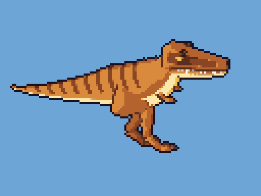
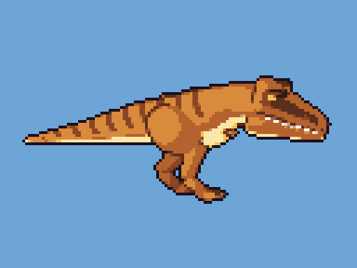
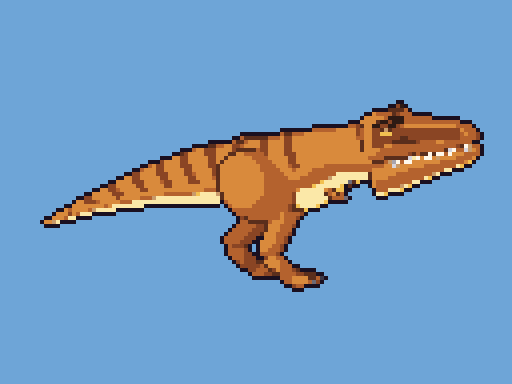
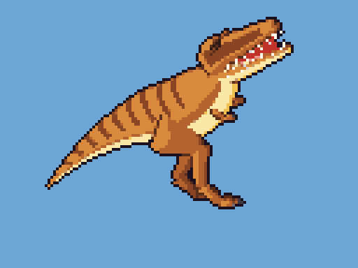
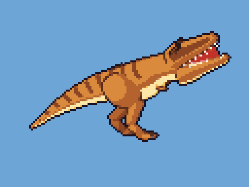

# DINO DUEL — 恐竜とエフェクトの絵の仕組み（Blender → ドット絵）

**Blender の3Dモデルを Python で作り、自動でドット絵に変換する仕組み**です。
多幸寿（Oh!Edo Taco Tuesday!!）と同じ方式で、画像生成AIは使っていません。

| 確認用の動き（4倍） | |
|---|---|
| 噛みつき（クラッシュファング） |  |
| 咆哮（暴君のおたけび） |  |
| 待機・被弾・たおれる |    |

いまは**段階1（ティラノサウルス1体と、その技2つ）**です。残りの恐竜と技は、確認のあとで足します。

## できるもの（`output/`）

| ファイル | 内容 |
|---|---|
| `dinos/<種>.png` | 1種の全部のコマを横に並べた1枚（1コマ 128×96 ドット） |
| `dinos/<種>_face.png` | 行動順・技えらびの丸いアイコン用の顔（40×40） |
| `fx/chomp.png` | 噛みつき：上下の歯が相手の上でガチンと閉じる（3Dで作る） |
| `fx/wave.png` / `fx/burst.png` | 咆哮：口から飛ぶ音の波 / 当たったときの衝撃波（3Dで作る） |
| `fx/spark.png` | 当たった瞬間の光（平面で描く） |
| `fx/aura.png` | 攻撃アップ：赤い炎と上向きの矢印（平面で描く） |
| `pix.js` | ゲームが読む一覧（どのコマが何の動きか・当たる瞬間のコマ・コマごとの口や体の位置・技と動きの対応） |
| `preview/*.gif` | 確認用の動き（4倍） |
| `models/<種>.blend` | 3Dモデル（待機の形）。Blender で開いて形や色を確かめられる |

**全部の絵が同じ32色のパレット**（`pipeline/palette.py`）だけで塗られ、カメラの角度とドットの大きさも全種でそろっています。

---

## 使い方（はじめての人向け）

### 0. 準備（最初の1回だけ）
1. Blender（5.2 以上）を `C:\Program Files\Blender Foundation\` に入れます。
2. このフォルダ（`art`）をエクスプローラーで開き、アドレスバーに `powershell` と入力して Enter。
3. 必要なライブラリを入れます：`python -m pip install pillow numpy`

### 1. 全部作り直す
```
python build.py
```
10秒ほどで `output/` が新しくなります。ゲームは `output/pix.js` を見て絵を読むので、作り直すだけでゲームに反映されます。

- 色（パレット）だけ変えたとき：`python build.py --skip-render`（レンダリングを省略。速い）
- 1種だけ：`python build.py --only tyranno`
- エフェクトだけ：`python build.py --jobs fx`
- 形を少しずつ直すとき：Blender を直接動かして、決めたコマだけ描けます（`build/renders/test_*.png`）
  ```
  & "C:\Program Files\Blender Foundation\Blender 5.2\blender.exe" -b --factory-startup -P blender/render_all.py -- --out build/renders --jobs dinos --test idle:0,bite:1
  python preview_test.py
  ```
  `build/test_sheet.png` に、ドット絵にしたものが並びます。

### 2. 確認する
`output/preview/*.gif` をダブルクリック。ゲームでは、バトルにティラノサウルスを入れると見られます（`?debug=1` なら全部の恐竜が使えます）。

---

## しくみ

```
python build.py
  ├─ Blender（画面なし）→ blender/render_all.py
  │    ├─ blender/dinos.py     … 恐竜ごとの形の数字・色、動き（ポーズの数字のコマ）、技と動きの対応（MOVES）
  │    ├─ blender/theropod.py  … 体型の型「二足歩行の肉食」：ポーズの数字から関節の位置を計算して形を作る
  │    ├─ blender/fx3d.py      … 3Dで作るエフェクト（噛みつきの歯・咆哮の輪）
  │    └─ blender/common.py    … カメラ・セル調の塗り・内側の線・形づくりの道具
  │    → build/renders/ に 4倍サイズの元画像 と meta_<種>.json（コマごとの口・頭・体の位置）
  ├─ pipeline/pixelate.py … ドット絵変換
  │    ├─ 縮小：ニアレストネイバー（色を混ぜない）
  │    ├─ 減色：固定32色パレット（人の目に近い OKLab 色空間で一番近い色）
  │    └─ 輪郭：絵の外側に 1px の暗い線
  ├─ pipeline/fx2d.py … 平面で描くエフェクト（光・炎）も、同じ変換を通す
  └─ output/ にコマを並べた1枚の絵・pix.js・確認用GIF・checksums.txt
```

### 恐竜の作り方（theropod.py）
- 骨組み（関節の位置）を数字で持ちます（`dinos.py` の `fwd`・`tail`・`head`・`leg`・`arm`）。
- 1コマごとに、ポーズの数字（体の傾き・首・頭・あごの開き・しっぽ・腕・呼吸）から関節の位置を計算し、形を作り直してレンダリングします。
- 体は しっぽの先 → 腰 → おなか → 胸 → 首 を **1本の管** でつなぐので、関節でつなぎ目ができません。
- 頭と下あごは別の部品（あごは ちょうつがい で開く）。口を開けると、奥に口の中（赤）と舌が見えます。
- 脚は**足の裏を地面に置いたまま**、ひざの位置を計算します（IK）。体が動いても足がすべりません。
- 模様（おなかのクリーム色・背中のしま）は、管の「前後・上下」の位置で塗るので、体が曲がってもずれません。

### 塗り方（セル調）
光の向き（左上・手前から）で「明るい色・地の色・影の色」の3段にパキッと塗り分け、部品が重なる所に、その部品の色を暗くした線を引きます（Blender の Freestyle）。外側の輪郭は、ドット絵にする段階で引きます。
地の色 → 影・明るい色・線 の組み合わせは `pipeline/palette.py` の `RAMP` です。

### ゲームとの合わせ方（js/game/pix.js・pix-anims.js）
- コマの切りかえは**時刻**で決めます。技の「当たる瞬間のコマ」（`dinos.py` の `impact`）は、タイミングの輪が縮みきる時刻に出ます。
- 噛みつきの歯が閉じるコマ・咆哮の波が相手に届く瞬間・当たったときの光も、同じ時刻に合わせています。
- 1ドットの大きさは、場の大きさに合わせて端末のピクセルの整数倍に決めるので、ドットがにじみません。

### 毎回同じ結果になる工夫
乱数は名前から作った固定の種を使い、Blender のレンダリングのノイズも固定しています。
`output/checksums.txt` に全部の絵の指紋（SHA-256）が書かれるので、作り直して変化がなければ同じ絵です。
`build/` は途中のファイルなので Git には入れていません。

---

## 恐竜・動き・技を足すとき（段階2で使う）

1. `blender/dinos.py` の `SPECIES` に1種足します。同じ型の恐竜をコピーして、形の数字と `colors` を書きかえます。
2. `ANIMS` にその恐竜の動き（`idle`・`hit`・`faint` と技の動き）を足します。1コマ = ポーズの数字です（`theropod.py` の `POSE` に全部の項目があります）。
   - 技の動きには `impact`（当たる瞬間のコマ）、`windup`・`strike`・`after`・`recover`（どのコマをいつ見せるか）を書きます。
3. `MOVES` に「技の名前 → 動きの名前」を足します（技の名前は `js/game/data.js`）。
4. `python build.py`。ゲームの技の進み方は `js/game/pix-anims.js`（噛みつき・咆哮など、動きの名前ごと）。

## 困ったとき
- **「Blender が見つかりません」**：PowerShell で `$env:BLENDER = "D:\Apps\Blender\blender.exe"` のように場所を教えてから `python build.py`。
- 黒い画面に `Error` の行が出たら、そのまま相談してください。
